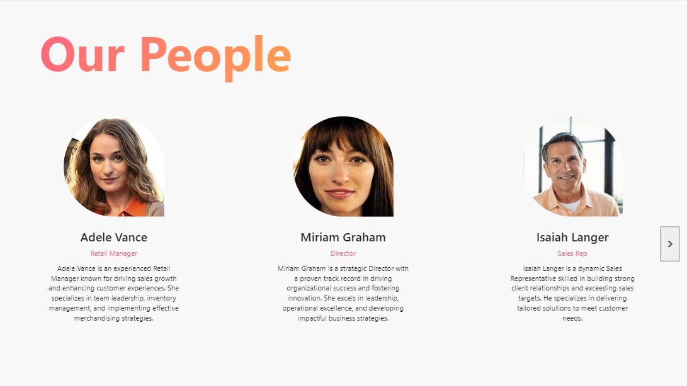
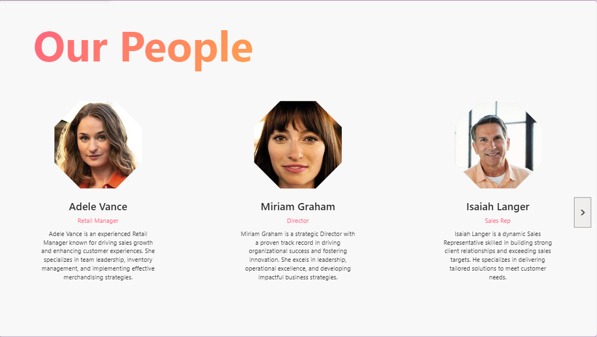
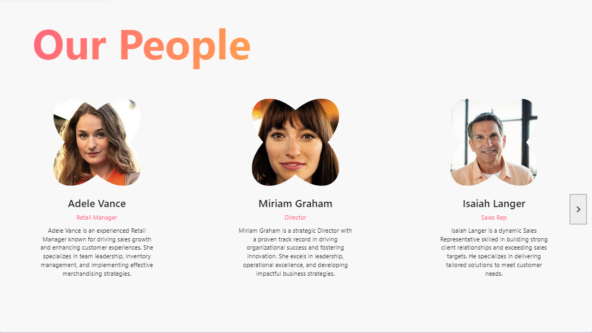

# Custom Image Shapes in Power Apps

In Power Apps, you can create custom image shapes using the HTML control and CSS rules. Below are a few techniques I’ve used to transform image shapes in Power Apps.

## Techniques for Custom Image Shapes

### 1. **border-radius**

This technique is perfect for rounding edges or creating perfect circles. It’s simple and versatile. You can experiment with different border shapes using the [CSS Border Radius Generator](https://10015.io/tools/css-border-radius-generator).

#### Example:



```powerapps
With(
    {
        containerStyle: $"
            position: relative; 
            width: 100%; 
            height: 100%;
        ",
        imageStyle: $"
            width: 100%;
            height: 100%;
            object-fit: cover;
            border-radius: 50% 50% 50% 50% / 50% 50% 0% 50%;
        "
    },
    With(
        {
            myHtml: $"""
                <div style='{containerStyle}'>
                    
                </div>
            """
        },
        Substitute(myHtml, """", "")
    )
)
```

### 2. **clip-path**

Use clip-path to create shapes like stars, triangles, or custom polygons. It’s great for more complex designs. The [CSS Clip-Path Maker](https://bennettfeely.com/clippy) is a useful tool to generate these shapes.

#### Example:



```powerapps
With(
    {
        containerStyle: $"
            position: relative; 
            width: 100%; 
            height: 100%;
        ",
        imageStyle: $"
            width: 100%;
            height: 100%;
            object-fit: cover;
            clip-path: polygon(30% 0%, 70% 0%, 100% 30%, 100% 70%, 70% 100%, 30% 100%, 0% 70%, 0% 30%);
        "
    },
    With(
        {
            myHtml: $"""
                <div style='{containerStyle}'>
                    
                </div>
            """
        },
        Substitute(myHtml, """", "")
    )
)

```

### 3. **mask**

The mask property is the most flexible, allowing you to apply any shape or pattern you want. This technique can be used for intricate designs or to align with a brand’s visual identity.

#### Example:



```powerapps
With(
    {
        containerStyle: $"
            position: relative; 
            width: 100%; 
            height: 100%;
            mask: url({gblMask5});
        ",
        imageStyle: $"
            width: 100%;
            height: 100%;
            object-fit: cover;
        "
    },
    With(
        {
            myHtml: $"""
                <div style='{containerStyle}'>
                    
                </div>
            """
        },
        Substitute(myHtml, """", "")
    )
)
```
*Note: The SVG was added to the global variable as Base64 during the initial load of the app.*

## Version history

Version |Date             |Comments
--------|-----------------|--------------------------------
1.0     |December 13, 2024 |Initial release

## Disclaimer
**THIS CODE IS PROVIDED *AS IS* WITHOUT WARRANTY OF ANY KIND, EITHER EXPRESS OR IMPLIED, INCLUDING ANY IMPLIED WARRANTIES OF FITNESS FOR A PARTICULAR PURPOSE, MERCHANTABILITY, OR NON-INFRINGEMENT.**


